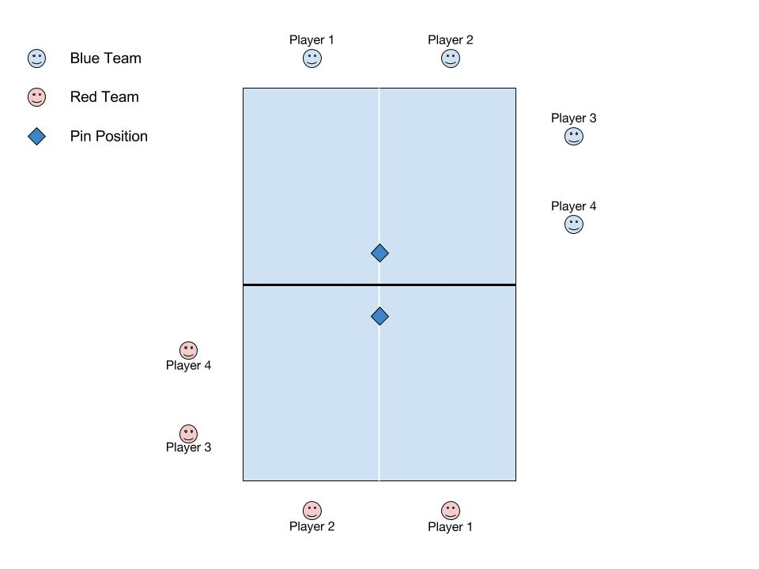

# pin-pong
Rules and regulations for "Pin Pong," a customization of the traditional ping pong game that makes it more fun for seasoned players and groups.

# Contents
* The Bradalog

# The Bradalog
The "Bradalog" (a play on the word "catalog") is used as our official playbook and determines the final say in all official rules. House rules may be used, but they must be announced and agreed upon prior to the start the game. Questions that arise during the game must use the official Bradalog to answer, or if an answer cannot be found, the question and possible solution should be noted and submitted for insertion to The Bradalog pending review of your peers.

# Player Requirements
Game requires at least 2 players, but is more fun with 4-8 players.

# Standard Table Setup

