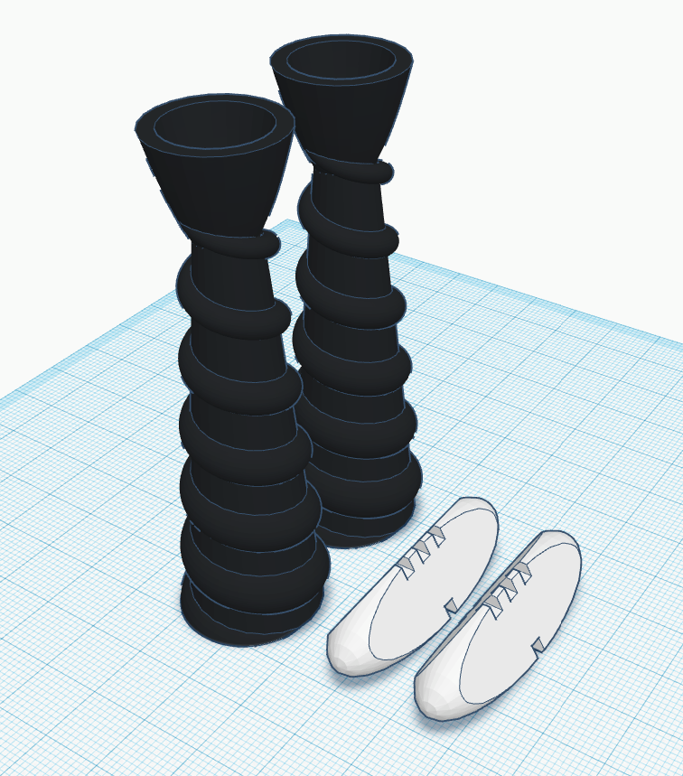

# Dungeons and Pong
Rules and regulations for "Dungeons and Pong," a customization of the traditional ping pong game that makes it more fun for seasoned players and groups.

# Contents
* [The Bradalog](#the-bradalog)
* [The Cards](#the-cards)

# The Bradalog

**This is Brad ^^**

The "Bradalog" (a play on the word "catalog") is used as our official playbook and determines the final say in all official rules. House rules may be used, but they must be announced and agreed upon prior to the start the game. Questions that arise during the game must use the official Bradalog to answer, or if an answer cannot be found, the question and possible solution should be noted and submitted for insertion to The Bradalog pending review of your peers. Read the typical Dungeons and Pong rules [here](rules.md)

# The Cards
Each card contains offensive or defensive spells on them that may be cast immediately (if offensive) or held for later use (if defensive). Defensive cards may be played to protect or negate a spell that has just been cast at them if one exists to do so. Read the starting cards [here.](cards.md)

# Player Requirements
Game requires at least 2 players, but is more fun with 4-8 players.

# Standard Table Setup

# Dice Holders and Dice
You may design your own or use real dice, but here is a suggested design.

# 3D Print Files
.stl files are also included.

* Holders and Dice: DnP-DiceHolders-Dice.stl
* Dice Only: DnP-DiceOnly.stl
* Holders Only: DnP-DiceHoldersOnly.stl

